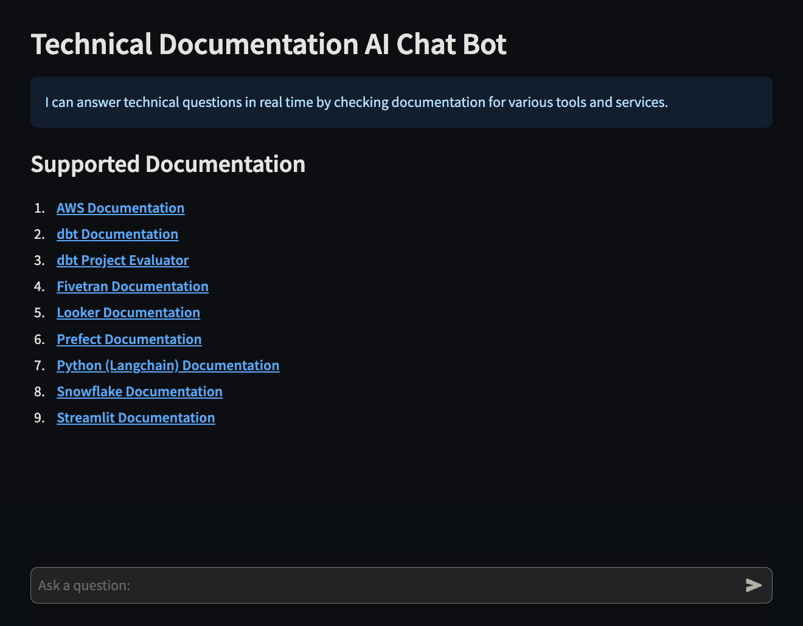
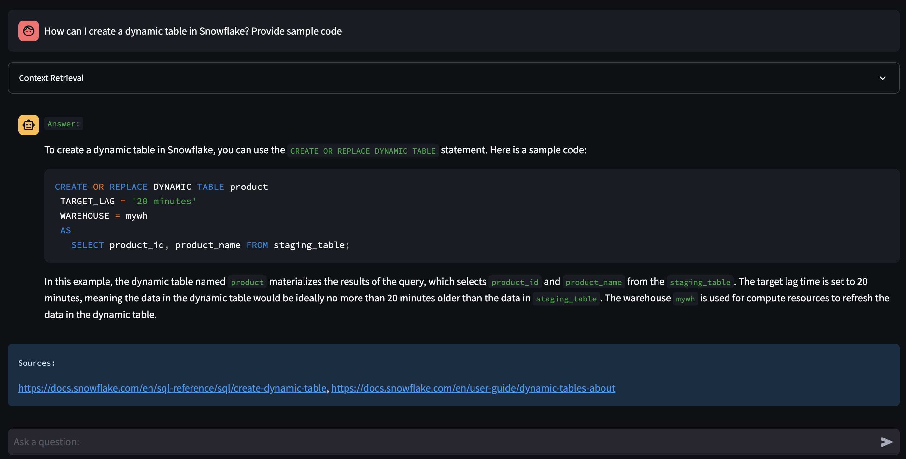
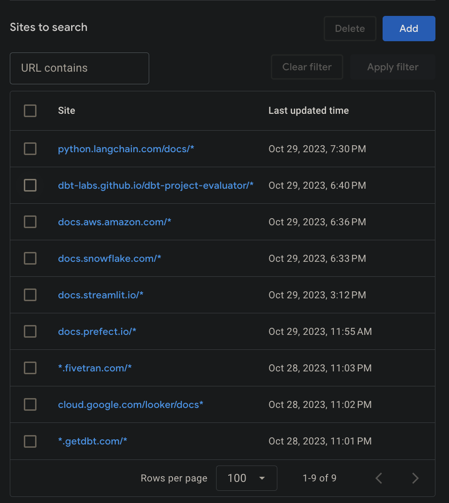

# 📄 Technical Documentation AI <a name="technical-documentation-ai"></a>

[](https://technical-documentation-ai.streamlit.app/)

[](https://python.org/)
[](https://streamlit.io/)
[](https://openai.com/)
[](https://www.langchain.com/)

## 🚀 Quick Navigation
- [📄 Technical Documentation AI](#technical-documentation-ai)
  - [✨ Description](#description)
  - [📚 Supported Documentation](#supported-documentation)
  - [🤖 How to Use](#how-to-use)
  - [💡 See the AI in Action](#see-the-ai-in-action)
  - [🙋‍♂️ User Question Processing Workflow](#user-question-processing-workflow)
  - [🔧 Configuration](#configuration)
    - [🛠️ API Key Configuration](#api-key-configuration)
  - [👷 Setup & Run for MacOS](#setup-run-for-macos)
  - [👷‍♀️ Setup & Run for Windows](#setup-run-for-windows)

## ✨ Description <a name="description"></a>
A powerful AI chatbot capable of providing real-time answers to technical questions by accessing documentation from various tools and services.

## 📚 Supported Documentation <a name="supported-documentation"></a>
1. [**AWS Documentation**](https://docs.aws.amazon.com)
2. [**dbt Documentation**](https://getdbt.com)
3. [**dbt Project Evaluator**](https://dbt-labs.github.io/dbt-project-evaluator)
4. [**Fivetran Documentation**](https://fivetran.com/docs)
5. [**Looker Documentation**](https://cloud.google.com/looker/docs)
6. [**Prefect Documentation**](https://docs.prefect.io)
7. [**Python (Langchain) Documentation**](https://python.langchain.com/docs)
8. [**Snowflake Documentation**](https://docs.snowflake.com)
9. [**Streamlit Documentation**](https://docs.streamlit.io)

## 🤖 How to Use <a name="how-to-use"></a>
Interact with the chatbot by sending your technical questions related to the supported tools and services. The chatbot will provide real-time responses by fetching relevant information from the specified documentation sources.

### 💡 See the AI in Action <a name="see-the-ai-in-action"></a>
### Startup Screen


### Sample Interaction
A typical dialogue with the AI, fetching a relevant response from Snowflake documentation.



## 🙋‍♂️ User Question Processing Workflow <a name="user-question-processing-workflow"></a>

To effectively handle a user’s question, the system performs the following steps:

1. **Query Generation**: Utilize a Large Language Model (LLM) to generate a comprehensive set of queries based on the provided user input.
2. **Search Execution**: Conduct searches for each of the generated queries.
3. **URL Storage**: Collect and store the URLs obtained from the search results in `self.urls`.
4. **URL Check**: Identify any URLs that are new and have not been processed previously, ensuring they do not exist in `self.url_database`.
5. **Content Transformation and Storage**: Load, transform, and add these new URLs exclusively to the vectorstore.
6. **Relevant Document Retrieval**: Query the vectorstore for documents that are relevant to the questions generated by the LLM.
7. **Final Result Preparation**: Ensure that only unique documents are selected, compiling them to form the final result set.

## 🔧 Configuration <a name="configuration"></a>
You only need to supply a few things.

In `settings()` function, supply:

* Search: Select the search tool you want to use (e.g., GoogleSearchAPIWrapper). 
* Vectorstore: Select the vectorstore and embeddings you want to use (e.g., Chroma, OpenAIEmbeddings).
* Select the LLM you want to use (e.g., ChatOpenAI).

To use `st.secrets` set enviorment variables in `.streamlit/secrets.toml` file.
 
Or, simply add environemnt variables and remove `st.secrets`: 
```
import os
os.environ["GOOGLE_API_KEY"] = "YOUR_API_KEY"
os.environ["GOOGLE_CSE_ID"] = "YOUR_CSE_ID" 
os.environ["OPENAI_API_BASE"] = "https://api.openai.com/v1"
os.environ["OPENAI_API_KEY"] = "YOUR_API_KEY"

```

### 🛠️ API Key Configuration <a name="api-key-configuration"></a>

- **`GOOGLE_API_KEY`**: Obtainable from [Google Cloud Console](https://console.cloud.google.com/apis/api/customsearch.googleapis.com/credentials).
  
- **`GOOGLE_CSE_ID`**: Accessible at [Google Programmable Search Engine](https://programmablesearchengine.google.com/), requiring site configuration.
  
  
- **`OPENAI_API_KEY`**: Retrieve from [OpenAI API Keys](https://beta.openai.com/account/api-keys).

## 👷 Setup & Run for MacOS <a name="setup-run-for-macos"></a>
```
python3.9 -m venv venv && source venv/bin/activate && pip3 install --upgrade pip && pip3 install -r requirements.txt && streamlit run technical-documentation-ai.py
```

## 👷‍♀️ Setup & Run for Windows <a name="setup-run-for-windows"></a>
```
python3.9 -m venv venv && .\venv\Scripts\activate && python -m pip install --upgrade pip && pip install -r requirements.txt && streamlit run technical-documentation-ai.py
```