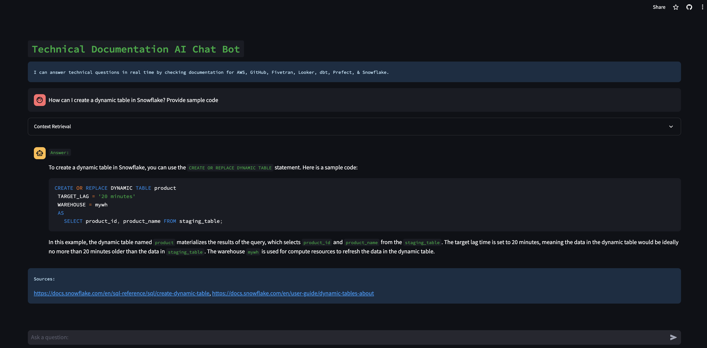

# 📄 Technical Documentation AI


[](https://streamlit.io/)
[](https://openai.com/)
[](https://www.langchain.com/)

[](https://technical-documentation-ai-g-efxnappvkcu9kyyaksqvpwl.streamlit.app/)

## ✨ Description
The AI chatbot can answer technical questions in real time by checking documentation for AWS, GitHub, Fivetran, Looker, dbt, Prefect, & Snowflake.

## 🙋‍♂️ Sample Q&A


## 🙋‍♂️ User Question Processing Workflow

To effectively handle a user’s question, the system performs the following steps:

1. **Query Generation**: Utilize a Large Language Model (LLM) to generate a comprehensive set of queries based on the provided user input.
2. **Search Execution**: Conduct searches for each of the generated queries.
3. **URL Storage**: Collect and store the URLs obtained from the search results in `self.urls`.
4. **URL Check**: Identify any URLs that are new and have not been processed previously, ensuring they do not exist in `self.url_database`.
5. **Content Transformation and Storage**: Load, transform, and add these new URLs exclusively to the vectorstore.
6. **Relevant Document Retrieval**: Query the vectorstore for documents that are relevant to the questions generated by the LLM.
7. **Final Result Preparation**: Ensure that only unique documents are selected, compiling them to form the final result set.

## 🔧 Configuration
You only need to supply a few things.

In `settings()` function, supply:

* Search: Select the search tool you want to use (e.g., GoogleSearchAPIWrapper). 
* Vectorstore: Select the vectorstore and embeddings you want to use (e.g., Chroma, OpenAIEmbeddings).
* Select the LLM you want to use (e.g., ChatOpenAI).

To use `st.secrets` set enviorment variables in `.streamlit/secrets.toml` file.
 
Or, simply add environemnt variables and remove `st.secrets`: 
```
import os
os.environ["GOOGLE_API_KEY"] = "YOUR_API_KEY"
os.environ["GOOGLE_CSE_ID"] = "YOUR_CSE_ID" 
os.environ["OPENAI_API_BASE"] = "https://api.openai.com/v1"
os.environ["OPENAI_API_KEY"] = "YOUR_API_KEY"

```

### 🛠️ API Key Configuration

- **`GOOGLE_API_KEY`**: Obtainable from [Google Cloud Console](https://console.cloud.google.com/apis/api/customsearch.googleapis.com/credentials).
  
- **`GOOGLE_CSE_ID`**: Accessible at [Google Programmable Search Engine](https://programmablesearchengine.google.com/), requiring site configuration.
  
  
- **`OPENAI_API_KEY`**: Retrieve from [OpenAI API Keys](https://beta.openai.com/account/api-keys).

## 👷 Setup & Run for MacOS
```
python3.9 -m venv venv && source venv/bin/activate && pip3 install --upgrade pip && pip3 install -r requirements.txt && streamlit run technical-documentation-ai.py
```

## 👷‍♀️ Setup & Run for Windows
```
python3.9 -m venv venv && .\venv\Scripts\activate && python -m pip install --upgrade pip && pip install -r requirements.txt && streamlit run technical-documentation-ai.py
```